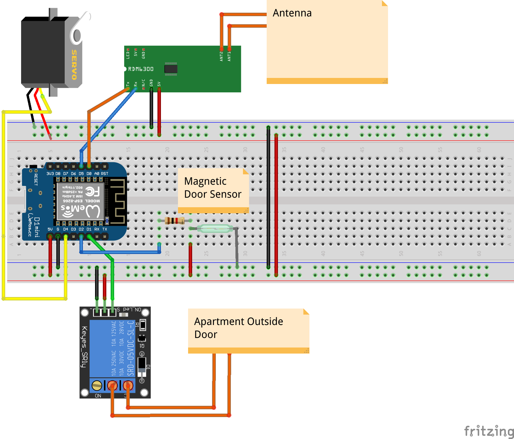

# iot_door_servo
Esp8266 door servo and rfid reader.

##Features
will be here soon...

## Hardware
* Wemos d1 mini (Esp8266)
* MG995 continuous rotation servo
* RDM6300 (EM4100) 125 kHz rfid reader
* Magnetic door switch(reed switch)
* Relay module

## Schematics

## 3D Printed Case
will be here soon...

## Credit
Libraries:
* [PubSubClient](https://github.com/knolleary/pubsubclient)
* [RFIDRdm630](https://github.com/electronicdrops/RFIDRdm630)